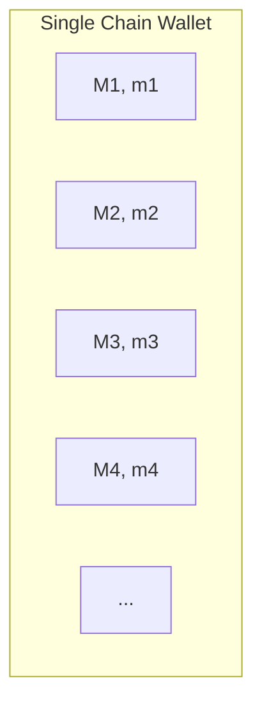
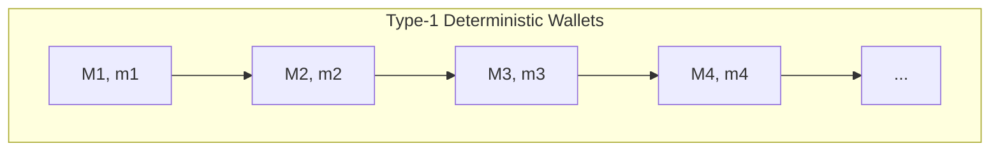
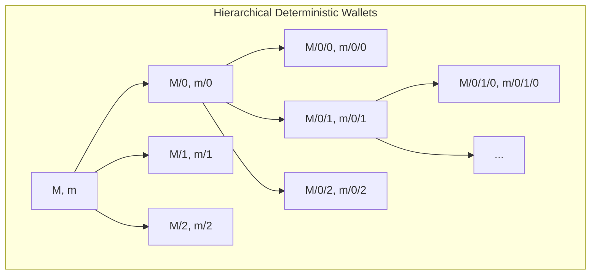

## Introduction

If you've heard about Bitcoin, it's likely you've heard about public and private key combinations. In short, both are just numbers. The main difference is that while a public key is where one might want to send bitcoin, whereas a private key is what verifies the person claiming the bitcoin actually owns it. That's why it is important that the private key remains private, otherwise anyone with that number can claim all your assets. It's also important that you store those keys somewhere safe, otherwise your Bitcoin are lost forever. We keep those keys safe in wallets.

## Type 1 Wallets

If asked to come up with a way of keeping some number of private keys safe, a Type 1 Wallet (sometimes called "Single Chain Wallet") might be what some people's initial thought. Simply put, these wallets just store the public and private keys in a list of sort. They might all be encrypted (and probably should be), but if you need 100 bitcoin addresses, a Type 1 Wallet will simply generate and save 100 addresses for you.

> Here we are using 'M' to denote a public key, and 'm' to denote a private key.

The obvious downside for Type 1 wallets is storage space. It's common practice to use a different Bitcoin address for every transaction, so this wallet can get quite big if you make transactions frequently. A better format of wallet would allow its users to have however many addresses they need *without* becoming too big.

## Type-1 Deterministic Wallets

That's where Type-1 *Deterministic* Wallets step in. They are *deterministic* because there is a way to *determine* an infinite(ish) list of public and private keys for use. This means we only have to remember the first master public and private keys to generate the addresses needed.

Now we can generate the ith public and private key combinations for whatever we need. However, Type-1 Deterministic Wallets have a vulnerability. Because all of the addresses are linked together, if any one of the private keys are leaked then our entire wallet can be derived.

Additionally, this kind of wallet isn't ideal if you want to differentiate between internal and external transactions, like a business might. Using Type-1 Deterministic Wallets means all the addresses are stored linearly, so any time you might want to have some structured organization to your wallet you'd need to remember it on your own.

## Hierarchical Deterministic Wallets

Hierarchical Determinsitic Wallets introduce that kind of structure that Type-1 Deterministic Wallets lacked. They store public and private keys in a tree structure, which is much more expressive in terms of which addresses are meant for what.

> Using an HD Wallet, a business might assign each first-level child to a department, and each department might assign their second-level keys to a particular project.

Another advantage to HD Wallets is that they make it easier to give information about its public keys *without* knowing the private keys. So for example, I could share the public key described by `M/0`, and someone else could derive all of the children public keys of what I shared. Doing this I can store the private information of my wallet offline, while I keep my public information freely accessible, without risking my assets getting stolen.

HD-Wallets also introduce an idea called Hardened Addresses. I won't go into them here, but they address the problem where leaking one private key from a Type-1 Deterministic Wallet will leak the whole wallet. Just know that they exist and that HD Wallets make use of them.

## Summary

Because of the decentralized nature of cryptocurrency, it is essential that public and private keys are kept secure. Typically this is done with a wallet of some kind. They each have their own advantages and disadvantages, but for Bitcoin the best standard is to use HD Wallets. They do this by deterministically storing keys such that they are cryptographically secure, and that users are able to share information about public addresses without risking their private keys.

You can learn more about HD Wallets here:

* [BIP-0032 Hierarchical Deterministic Wallets](https://github.com/bitcoin/bips/blob/master/bip-0032.mediawiki)
* [*Bitcoin and Cryptocurrency Technologies: A Comprehnsive Introduction*](https://a.co/d/evj0JLE), Chapter 4 - How to Store and Use Bitcoin
* [*Mastering Bitcoin: Programming the Open Blockchain*](https://a.co/d/1MiUWwC), Chapter 5 - Wallets
