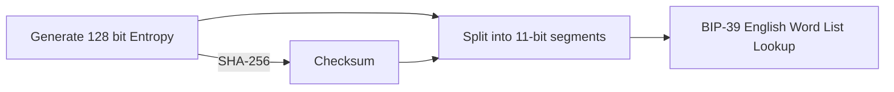
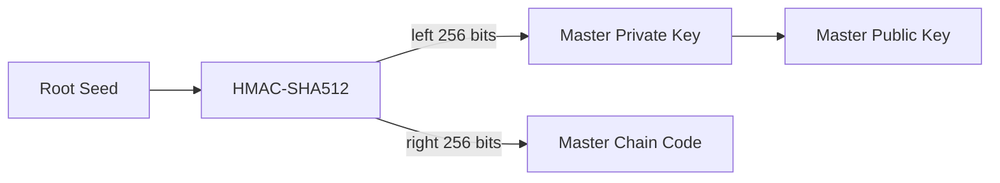
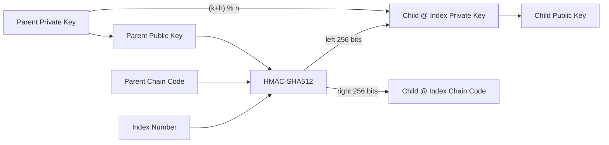
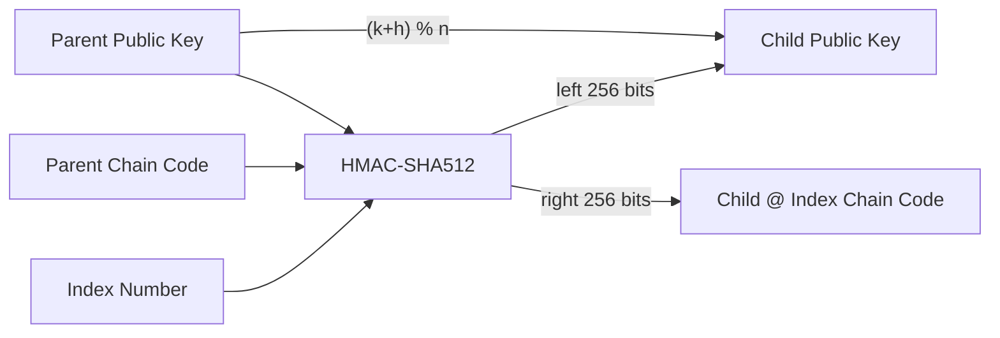
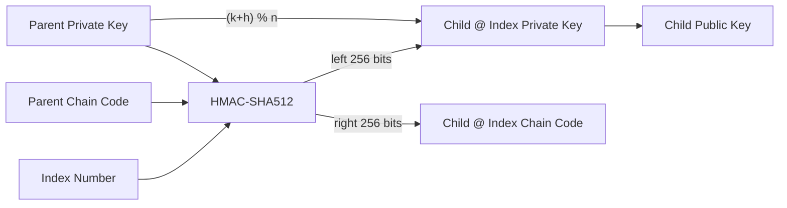

## Introduction

[BIP-32](https://github.com/bitcoin/bips/blob/master/bip-0032.mediawiki) defines a standard for Hierarchical Deterministic (HD) Wallets. It enables the creation of a tree-like structure of key pairs, allowing for secure and convenient management of cryptocurrencies. I'm currently learning about HD Wallets as a part of my Blockchain Technologies university course, but I wanted to supplement what I was learning about with some practical experience. So I started writing code.

> [Read here for my overview of what HD Wallets are](../bitcoin-wallets#hierarchical-deterministic-wallets)
{: .prompt-tip }

At a high level, there are three basic steps to creating an HD Wallet:

1. **Generate a random seed** - This will be used to make the master keys
2. **Generate the root node** - This will be used for generating children nodes
3. **Deriving children** - Each child node has its own set of keys

I'll show parts of how I accomplished each of these steps in both Python and Rust. You can see [the full project here](https://github.com/zobiejrz/bip-32).

## Generating a Random Seed

The random seed is what is responsible for ensuring that each HD wallet is unique. These typically come in lengths of 128, 256, or 512 bits, and technically speaking you could simply generate any random bitstring on your own to use. However, I'm not especially gifted when it comes to memorizing 128 bits, let alone 512, so I made use of [BIP-39](https://github.com/bitcoin/bips/blob/master/bip-0039.mediawiki).

BIP-39 creates a list of mnemonic strings to easier store those bitstrings. After generating an entropy value (the bitstring seed from before), you find and append its checksum value, then split it evenly into 11-bit segments. Those segments correspond with a word in the BIP-39 word list, which exists for a number of languages. Those mneumonics can then be turned back into a random seed value. Additionally, an optional passphrase can be used at this point to further protect this seed (which is important because it generates the root node).



> High level overview of the BIP-39 process for 128 bits

In Python I implemented this using the [trezor/python-mnemonic](https://github.com/trezor/python-mnemonic) library, and in Rust I implemented this using [infincia/bip39-rs](https://github.com/infincia/bip39-rs).

## Generating the Root Node

The root node is what stores the master public key and the master private key, as well as a master chain code. You do this by simply taking the HMAC-SHA512 hash of the seed. The left 256 bits of the result is the master private key, and the right 256 bits of the result is the master chain code.



> High level overview for how the root node is generated

To get the master public key, you just do the ECC Point multiplication of `<private key>*<secp256k1 generator point>`. This process can be done with the [Double-and-add algorithm](https://en.wikipedia.org/wiki/Elliptic_curve_point_multiplication#Double-and-add), and the value for that generator point can be found [here](https://en.bitcoin.it/wiki/Secp256k1).

Rust I used the `k256` and `elliptic-curve` crates to perform the ECC point multiplication. In Python I implemented my own version that looks like this:

```python
def __double_and_add(P, d, a=0, field=P):
    if d == 0:
        return PaI # This is the 'Point at Infinity', representing an invalid key
    elif d == 1:
        return P
    elif d % 2 == 1:
        return __point_add(P, __double_and_add(P, (d - 1), a=a, field=field), a=a, field=field)
    else:
        return __double_and_add(__point_double(P, a=a, field=field), d // 2, a=a, field=field)
```

> The `field=P` parameter is another constant specified [here](https://en.bitcoin.it/wiki/Secp256k1). For testing with smaller curves I made it adjustable.


## Deriving Children

Now that we have the root node, the last step is to define the process that derives all the children nodes. There are two methods of doing this, that either create what is referred to as a 'normal' child or a 'hardened' child. There are security reasons to use a combination of both types of children, but here I'll just be discussing how they are made.

### Normal Children

We can generate a normal child given an index, the parent's private key, the parent's public key, and the parent's chain code.

First you take the HMAC-SHA512 hash of the parent's public key, the chain code, and index. The chain code acts as the key for the HMAC-SHA512 hash, and the message of the hash is the parent's public key concatenated with the index. Here's what that might look like in Python:

```python
import hmac, hashlib

hash = hmac.new(
    parentChainCode,
    msg=(parentPubKey + childIndex),
    digestmod=hashlib.sha512,
).digest()
```

This value is then split like we did for the root node, resulting in two 256-bit integers. The right hand side is the child's chain code. To get the child's private key we add the left hand side to the parent's private key, mod N (which again is a constant for secp256k1).



We can also choose to generate the child's public key, *without* knowledge of any private key:



### Hardened Children

The process for generating hardened children is much the same as before. Here's the main difference is in the HMAC-SHA512 hash we take. Rather than the parent's public key, we use the parent's private key directly. Here's what that change looks like:

```python
import hmac, hashlib

hash = hmac.new(
    parentChainCode,
    msg=(parentPubKey + childIndex),
    digestmod=hashlib.sha512,
).digest()
```

And here's how the diagram changes:



## Putting It All Together

BIP-32 includes test vectors, and after getting all the algorithms together, I was able to verify that both my Python and Rust implementations were functional. Here's how I used them:

```rust
use zobie_bip32::HDWallet;        // My code
use bip39::{Mnemonic, Language};  // BIP-39

// Specify mnemonic parameters
let language = Language::English;
let num_words = 12; // can be 12, 15, 18, 21, or 24
let passphrase = "some phrase";

// Generate list of mnemonics given the language
let mnemo = Mnemonic::generate_in(language, num_words)
  .expect("Cryptographically secure mnemonic");
let words = mnemo.to_string();

// Create Wallet
let wallet = HDWallet::new_from_words(language, &words, &passphrase);
```

```python
from Wallet import HDWallet   # My code
from mnemonic import Mnemonic # BIP-39

# Specify mnemonic parameters
lang = "english"
passphrase = ""
strength = 128

# Generate list of mnemonics given the language
mnemo = Mnemonic(lang)
words = mnemo.generate(strength=strength)

# Create Wallet
wallet = HDWallet(using='words', words=words, passphrase=passphrase, lang=lang)
```

For both wallets I specified a `get(path)` function to get the public and private keys for any child. Here is what it looks like in rust (though it is much the same for Python):

```rust
wallet.get("M/0'/1"); // Returns the public key as a string (xpub format) for the 1st child of the 0th hardened child
wallet.get("m/0'/1"); // Returns the private key as a string (xprv format) for the 1st child of the 0th hardened child
```

## Summary

This project taught me a lot. I had so much fun unpacking the inner workings of Bitcoin addresses and learning about the eclliptic curve math operations. Then, being able to develop my own wallet implementation was a fantastic way to both bring everything I had learned together in one project, as well as introduce me to the world of Rust.

One feature I had hoped to implement but didn't have time for was initializing a wallet from a public key. This should allow for someone to generate all of the public keys for all of the child nodes, and would use much of the same code as before. I also think it would be awesome if I had time to implement some kind of command-line tool or app that uses this to actually track crypto assets.

You can find the project in my GitHub, [zobiejrz/bip-32](https://github.com/zobiejrz/bip-32).
